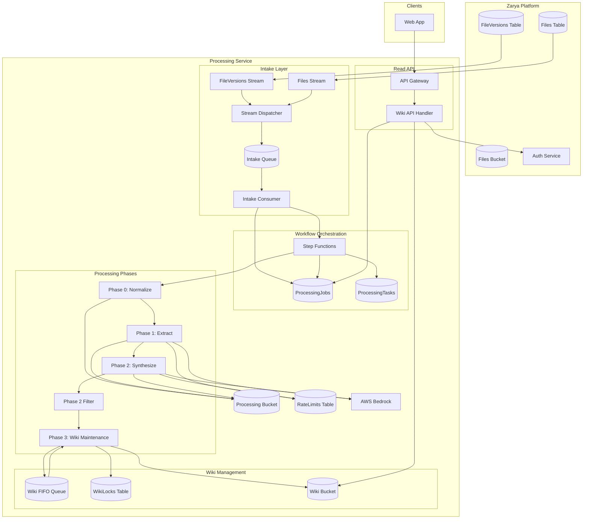

# Architecture Overview

> High-level architecture of the wiki processing service.
> For detailed specifications, see feature and interface documents.

---

## Purpose

The wiki processing service transforms uploaded documents into persistent, structured wiki content. Each Zarya folder maintains its own wiki—a collection of interlinked Markdown pages synthesized from source documents.

The service:

1. Receives file upload events from Zarya
2. Extracts and normalizes source documents
3. Uses LLM to extract claims and synthesize pages
4. Maintains wiki structure (index, graph, cross-links)
5. Serves wiki content via API

---

## System Diagram



---

## Component Inventory

### Compute

| Component          | Type             | Purpose                              |
| ------------------ | ---------------- | ------------------------------------ |
| Stream Dispatcher  | Lambda (Node.js) | Routes DynamoDB stream events to SQS |
| Intake Consumer    | Lambda (Node.js) | Validates, dedupes, starts workflows |
| Phase 0 Normalize  | Lambda (Python)  | PDF → Markdown conversion            |
| Phase 1 Extract    | Lambda (Python)  | LLM claim extraction (Map state)     |
| Phase 1 Aggregate  | Lambda (Python)  | Deduplicates and normalizes claims   |
| Phase 2 Synthesize | Lambda (Python)  | LLM page synthesis (Map state)       |
| Phase 2 Filter     | Lambda (Python)  | Filters output pages by quality      |
| Phase 3 Wiki       | Lambda (Python)  | FIFO consumer, wiki maintenance      |
| Wiki API           | Lambda (Node.js) | API Gateway handler for reads        |

### Storage

| Component         | Type     | Purpose                      |
| ----------------- | -------- | ---------------------------- |
| ProcessingJobs    | DynamoDB | Job tracking and audit trail |
| ProcessingTasks   | DynamoDB | Per-phase task tracking      |
| WikiLocks         | DynamoDB | Defense-in-depth lock table  |
| RateLimits        | DynamoDB | LLM rate limiting state      |
| Processing Bucket | S3       | Intermediate artifacts       |
| Wiki Bucket       | S3       | Published wiki content       |

### Messaging

| Component       | Type         | Purpose                              |
| --------------- | ------------ | ------------------------------------ |
| Intake Queue    | SQS Standard | Buffer between streams and workflows |
| Intake DLQ      | SQS Standard | Failed intake messages               |
| Wiki FIFO Queue | SQS FIFO     | Serializes wiki writes per folder    |
| Wiki DLQ        | SQS FIFO     | Failed wiki maintenance messages     |

### Orchestration

| Component           | Type           | Purpose                            |
| ------------------- | -------------- | ---------------------------------- |
| Processing Workflow | Step Functions | Multi-phase workflow orchestration |

---

## Data Flow

### Write Path (Document Processing)

```
1. User uploads PDF → Zarya Files Bucket
2. Zarya inserts FileVersion → FileVersions table
3. DynamoDB Stream emits INSERT event
4. Dispatcher Lambda routes to Intake Queue
5. Intake Consumer validates:
   - PDF extension check
   - Version ID validation against Zarya
   - Duplicate detection (same file, same status)
6. Intake Consumer starts Step Functions execution
7. Step Functions orchestrates:
   - Phase 0: Download PDF, normalize to Markdown
   - Phase 1: Chunk Markdown, extract claims via LLM
   - Phase 2: Synthesize wiki pages via LLM, filter quality
   - Phase 3: Send to FIFO queue, wait for callback
8. Phase 3 Lambda (FIFO consumer):
   - Acquire WikiLock
   - Read current wiki from S3
   - Merge new pages
   - Write changes to wiki bucket (flat layout)
   - Send callback to Step Functions
9. Step Functions marks job COMPLETED
```

### Read Path (Wiki Access)

```
1. Client requests wiki content via API Gateway
2. Wiki API handler:
   - Extracts folder ID from path
   - Calls Zarya auth API (viewWikiSummary or readWikiContent)
   - If authorized, reads content from Wiki Bucket
   - Returns content (or 403/404)
```

### Delete Path (Source Removal)

```
1. User archives file in Zarya
2. Zarya marks file DELETED in Files table
3. DynamoDB Stream emits MODIFY event
4. Dispatcher routes to Intake Queue with ARCHIVE_SOURCE action
5. Intake Consumer starts workflow with archive mode
6. Phase 3 removes source's contributions from wiki
7. If source was sole contributor to a page, page is removed
```

---

## Zarya Integration Points

| Integration          | Mechanism                | Direction          |
| -------------------- | ------------------------ | ------------------ |
| File version events  | DynamoDB Streams         | Zarya → Processing |
| File deletion events | DynamoDB Streams         | Zarya → Processing |
| Source file access   | S3 (cross-account)       | Processing → Zarya |
| Version validation   | DynamoDB (cross-account) | Processing → Zarya |
| Authorization        | HTTP API                 | Processing → Zarya |

### Cross-Account Access

Processing service runs in a separate AWS account from Zarya. Cross-account access:

- S3: Bucket policy grants read to Processing role
- DynamoDB: Resource policy grants read to Processing role
- Streams: Cannot be shared; Zarya exposes via EventBridge (future) or Processing role consumes directly

---

## Key Design Patterns

### Trace ID: fileVersionId

Every processing job is identified by `fileVersionId`. This ID:

- Comes from Zarya's FileVersions table
- Becomes Step Functions execution name (idempotency)
- Appears in all logs and metrics
- Links artifacts in S3

### Aggregate Key: folderId

Wiki content is scoped to Zarya folders:

- Each folder has one wiki
- FIFO MessageGroupId = folderId
- Wiki bucket key prefix = `wiki/{folderId}/`
- Authorization checked per folder

### Orchestration: Step Functions Owns Terminal Status

Only Step Functions writes terminal job status (COMPLETED, FAILED). This prevents:

- Race conditions between phases
- Inconsistent status reporting
- Lost terminal transitions

### Serialization: FIFO + Lock

Wiki writes are serialized per folder:

1. **Primary**: FIFO queue with MessageGroupId = folderId
2. **Secondary**: WikiLocks table with conditional writes

Two mechanisms provide defense-in-depth against visibility timeout edge cases.

### Validation: VersionId Before Processing

Before processing a file:

1. Read source with specific S3 VersionId
2. If VersionId doesn't match Zarya's current FileVersion, abort

This prevents processing stale versions when a file is updated during processing.

---

## Security Model

### Authentication

- **Internal**: IAM roles for all service-to-service calls
- **External**: Cognito JWT for API Gateway

### Authorization

- **viewWikiSummary**: Folder visibility in Zarya
- **readWikiContent**: Access to ALL sources in folder

### Data Protection

- **At rest**: SSE-S3 for all buckets, encryption for DynamoDB
- **In transit**: TLS everywhere
- **Secrets**: Secrets Manager for configuration

### Content Security

- LLM prompts include guardrails against harmful content
- Synthesized content logged for audit
- No PII extraction (wiki contains claims, not personal data)

---

## Observability

### Logging

All components emit structured JSON logs with:

- `fileVersionId` - Trace ID
- `folderId` - Aggregate key
- `phase` - Processing phase
- `component` - Lambda function name

### Metrics

| Metric           | Dimension        | Purpose          |
| ---------------- | ---------------- | ---------------- |
| JobsCreated      | folderId         | Ingestion rate   |
| JobsCompleted    | folderId         | Success rate     |
| JobsFailed       | folderId, reason | Failure analysis |
| PhaseDuration    | phase            | Performance      |
| LlmTokensUsed    | model, phase     | Cost tracking    |
| WikiPagesCreated | folderId         | Output volume    |

### Alarms

| Alarm                   | Threshold     | Severity |
| ----------------------- | ------------- | -------- |
| DLQ depth > 0           | Any message   | P2       |
| Job failure rate > 20%  | 15 min window | P1       |
| Phase duration > 2x p95 | 15 min window | P2       |
| Bedrock errors > 10     | 5 min window  | P1       |

---

## Non-Functional Requirements

| Requirement         | Target                                     |
| ------------------- | ------------------------------------------ |
| Throughput          | 60 PDFs/hour (batch), 5 PDFs/hour (steady) |
| Latency (small PDF) | < 5 minutes end-to-end                     |
| Latency (large PDF) | < 30 minutes end-to-end                    |
| Availability        | 99.5% (batch processing tolerance)         |
| Data durability     | 99.999999999% (S3 standard)                |
| Recovery time       | < 1 hour (automated)                       |

---

## Future Considerations

### Scale

- Current design handles ~1000 PDFs/day per account
- Beyond that: consider SQS FIFO partitioning, parallel wikis

### Features

- Page-level authorization (beyond folder level)
- Real-time wiki updates (currently batch)
- Multi-model synthesis (compare outputs)

### Integration

- EventBridge for cross-account events (replace DynamoDB streams)
- AppSync subscriptions for real-time wiki updates

---

## Related Documents

| Document                              | Purpose               |
| ------------------------------------- | --------------------- |
| [System Contract](system-contract.md) | Invariants and rules  |
| [Feature Specifications](features/)   | Detailed requirements |
| [Interface Definitions](interfaces/)  | Schemas and contracts |
| [Operations](ops/)                    | Deployment and ops    |
| [Architecture Decisions](decisions/)  | ADRs                  |

---

## Changelog

| Date       | Change                         |
| ---------- | ------------------------------ |
| 2026-05-13 | Initial architecture extracted |
